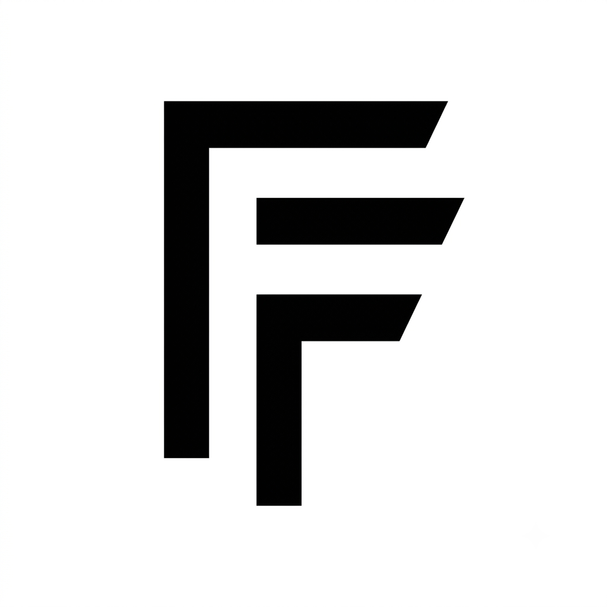

<p align="center">
  
</p>

# creality-print-setup

Version-controlled backup of my custom [Creality Print](https://www.crealitycloud.com/software-firmware/creality-print) profiles — printer, filament, and process presets calibrated on my own machines.

Creality Print keeps user presets in an application-support folder that gets wiped or migrated on upgrade, so they live here instead.

## Layout

```
<Printer>/
  Printer Profiles/    machine presets  (bed size, Z offset, kinematics, start/end G-code)
  Filament Profiles/   filament presets (temps, cooling, flow)
  Process Profiles/    print presets    (layer height, walls, infill, supports)
```

| Printer | Printer | Filament | Process |
| --- | --- | --- | --- |
| Creality Hi | — | PLA · PETG · ABS | PLA · PETG · ASA |
| Creality K1 Max | PLA · PETG · ASA | PLA · PETG · ABS | PLA · PETG · ASA |
| Creality K2 Plus | Purge and wipe | PLA · PETG · ASA · ABS | PLA · PETG · ASA · PLA (miniatures) · ASA (fine detail) |

Process profiles exist at both 0.20mm and 0.16mm, so the counts above are per
layer height — 22 process profiles in total. The two K2 Plus specials are the
exceptions: the miniatures and fine-detail presets exist at 0.20mm only.

The three ABS filament presets were written here, not saved from Creality
Print after calibration. They adapt the K2 Plus ASA cooling to each machine but
haven't been print-tested yet. The same goes for the K1 Max PLA and PETG
filament presets, which carry the Hi's cooling for those materials across
untested. There are no ABS process or printer presets. Use the ASA process
preset for ABS parts.

A folder only appears where a preset was actually saved and calibrated; a dash means there's nothing worth keeping, not that it's missing. The Hi runs fine on the stock machine preset, so it doesn't have one here.

Every preset is JSON exported from Creality Print 7.x. They're diffs, not full configs: each carries an `inherits` field naming the stock Creality preset it's based on and stores only the keys that were changed. That keeps them small and readable, but it also means **the matching stock preset must exist in your Creality Print install** for these to load.

## What's calibrated

Each printer has its profiles at two layer heights, **0.20mm** and **0.16mm**,
carrying identical overrides. The 0.16mm variants inherit Creality's own 0.16mm
stock presets, so its layer-height adjustments — more bottom and top shell
layers, faster bridging and infill — still apply underneath. Only the settings
listed below are overridden.

Common ground across all three printers: gyroid sparse infill, organic tree
(auto) supports at a 45° threshold with small overhangs kept rather than pruned,
an outer-only brim at a 0.13 mm object gap, a back seam, and a shared support
clearance of 0.5 mm XY with a rectilinear interface at 0.7 mm spacing. Supports
are enabled in every profile, so turn them off per-model when they aren't
wanted.

Supports build from the plate only — none are generated resting on the model
itself. That keeps upper surfaces unmarked, at the cost of leaving mid-air
overhangs above the model body unsupported; turn it off per-model for parts
that need internal support.

Every process profile is also tuned for fine detail, such as relief coins and
small raised text:

- **Walls** — Arachne walls and a precise outer wall keep thin raised lines as
  walls instead of gap fill, and the outer wall line width drops from 0.42 to
  0.38 mm so the nozzle traces tighter curves and sharper corners
- **Travel** — avoid crossing walls, so the nozzle routes around finished
  detail instead of dragging across it and stringing between raised features

Speed, acceleration and jerk are left at Creality's stock values in every
profile, the K1 Max ASA included — the sole exception is the K2 Plus ASA
fine-detail preset, which slows walls and infill deliberately. Use the 0.16mm
variants for the finest relief work.

What stays per-printer is the support Z gap — 0.23 mm on the Hi and K1 Max,
0.25 mm on the K2 Plus — along with wall counts and infill density.

### Creality Hi

Process presets inherit `0.20mm Standard @Creality Hi 0.4 nozzle`. All three use an outer-only brim and a 100 % raft first layer, and leave line widths other than the outer wall at stock.

- **PLA** — 3 walls
- **PETG** — 3 walls
- **ASA** — 6 walls and 40 % infill for strength

All three share the 0.23 mm support Z gap, so supports release cleanly on any
material.

The filament preset `Generic PETG @Creality Hi 0.4 nozzle - Calibrated` turns cooling right down: 20–30 % fan, off entirely for the first 5 layers, no fan stop/start smoothing. That's what keeps layer adhesion and stops warping on PETG.

`Generic PLA @Creality Hi 0.4 nozzle - Calibrated` eases cooling off rather than
killing it: 40 % minimum fan reaching full by layer 10, off for the first 5
layers, overhangs at 75 % instead of 100 %, and the epoxy-resin-plate first
layer at 65 °C. This is the preset the K2 Plus PLA one was derived from.

`Generic ABS @Creality Hi 0.4 nozzle - Calibrated` takes the K2 Plus ASA
cooling: 0–25 % fan instead of stock 40–70 %, off for the first 5 layers and
reaching its ceiling by layer 5, and overhangs at 35 % rather than 80 %. Stock
Hi ABS already has fan stop/start smoothing off. The epoxy-resin-plate first
layer is 95 °C, the Hi's usual 5 °C over stock. The Hi has no air filtration,
so the ASA preset's exhaust and filtration settings are left out. The Hi is also
the only open-frame printer of the three, so it is the most prone to ABS warping.

### Creality K1 Max

The printer presets exist **only to carry a per-material Z offset** — everything else is identical to the stock `Creality K1 Max 0.4 nozzle`:

| Preset | Z offset |
| --- | --- |
| `- PLA` | 0.05 mm |
| `- PETG` | 0.175 mm |
| `- ASA` | 0.7 mm |

Pick the printer preset matching your filament, or first layers will be squashed
or lifted.

All three declare a 300 × 295 mm printable area rather than the nominal
300 × 300. The strip beyond Y = 295 is already listed as excluded on the stock
preset, so trimming the printable area keeps the slicer from placing parts
where they cannot be printed.

Process presets inherit `0.20mm Standard @Creality K1 Max 0.4 nozzle`, all at 3 walls with a 0.5 mm support XY distance and Z-overrides-XY spacing — except ASA:

- **PLA** — 5 bottom shell layers
- **PETG** — 10 mm outer brim, 0.23 mm support Z gap
- **ASA** — the heavily tuned one. 4 walls, 25 % infill, monotonic top surface, a 0.21 mm support Z gap, slowdown for curled perimeters, elephant foot and XY hole compensation. Speed, acceleration and jerk are stock like every other profile; its former hand-tuned ladder (120 mm/s outer wall at 2500, a 30 mm/s first layer at 500, 40 / 25 / 20 mm/s overhangs, 400 mm/s travel) is recoverable from commit `fd470b1` if ASA first layers or overhangs suffer without it

`Generic PLA @Creality K1 Max 0.4 nozzle - Calibrated` carries the Hi's PLA
cooling unchanged: 40 % minimum fan reaching full by layer 10, off for the first
5 layers, and overhangs at 75 % instead of stock 100 %. Those are absolute
percentages, so they move across machines untouched, and the fan ceiling is left
at the stock 100 %.

Its first-layer plate bump is the one value that could not be translated
literally. The Hi and K2 Plus presets both bump
`epoxy_resin_plate_temp_initial_layer`, but the K1 Max has no epoxy-resin plate
— stock reports it as 0 °C on both PLA and ABS. Its three real plate types
(hot, textured and cool) all sit at 50 °C stock for PLA, so the +5 °C goes on
the textured plate, the one the K1 Max ships with, at 55 °C. Swap the key to
`hot_plate_temp_initial_layer` or `cool_plate_temp_initial_layer` if you print
PLA on a different sheet; the value is 55 either way. Like the other PLA
presets it leaves air filtration alone.

`Generic PETG @Creality K1 Max 0.4 nozzle - Calibrated` is the Hi PETG preset
moved across, the same way the K2 Plus one was: 20–30 % fan against stock
40–90 %, off for the first 5 layers and at its ceiling by layer 5, and no fan
stop/start smoothing. Those fan figures are absolute percentages, so they
transfer unchanged, and overhangs are left at the stock 100 %, as on the Hi.

Its first-layer bump goes on the textured plate at 75 °C, following the Hi's
+5 °C over stock rather than its literal 85 °C, since the K1 Max starts from
70 °C there. Unlike PLA and ABS the K1 Max does report an epoxy-resin plate for
PETG, at the same 70 °C, but the bump goes on the textured plate anyway — that
is the sheet the machine ships with. Swap the key to
`epoxy_resin_plate_temp_initial_layer` or `hot_plate_temp_initial_layer` if you
print PETG on a different sheet; both sit at 70 °C stock too, so the value is 75
on any of the three. The cool plate is the odd one out, at 60 °C stock, so use
65 in `cool_plate_temp_initial_layer` there. Like the other PETG presets it
leaves air filtration alone. PETG already has its own printer preset for the
0.175 mm Z offset and process presets at both layer heights, so this completes
the set.

`Generic ABS @Creality K1 Max 0.4 nozzle - Calibrated` carries the K2 Plus ASA
regime unchanged: 0–25 % part cooling instead of stock 10–60 %, off for the
first 5 layers and at its ceiling by layer 5, no fan stop/start smoothing, and
overhangs at 35 % rather than 80 %. Air filtration is on, with the exhaust fan
at 20 % while printing and 100 % once finished. Plate temperature stays at the
stock 100 °C, the K1 Max bed's maximum, so it has no first-layer bump. There's
no ABS printer preset, so ABS has no Z offset of its own yet.

### Creality K2 Plus

Process presets inherit `0.20mm Standard @Creality K2 Plus 0.4 nozzle`, all at
3 walls. The PETG and ASA presets carry the 0.25 mm support Z gap; the PLA pair
does not set it and so runs at the stock 0.2 mm.

The printer preset `Creality K2 Plus 0.4 nozzle - Purge and Wipe Nozzle After
Each Layer` exists to stop ASA clogging the nozzle on long prints, and it worked:
ASA had been failing at random points hours in, and stopped once this was in use.
Everything else is identical to the stock `Creality K2 Plus 0.4 nozzle`. It only
adds layer-change G-code that, after every layer but the first, parks at the rear
chute, purges 6 mm of filament, runs the part fan flat out for 5 s to harden the
blob, wipes on the silicone strip and returns. That costs roughly 9–11 s per
layer and about 9 g of filament per 500 layers.

The moves are not hand-written, and shouldn't be. The chute sits beyond the
firmware's Y limit — the toolhead maximum is Y 352, the wiper is at Y 374–378 —
so ordinary moves there fail with "y-axis coordinate out of range". The preset
calls the firmware's own commands instead: `box_go_to_extrude_pos`,
`box_nozzle_clean` and `box_move_to_safe_pos` know the positions from the
printer's `box.cfg` and handle the limit themselves. They are bracketed by
`box_save_fan` / `box_restore_fan`, so the cooling blast doesn't leave part
cooling stuck at full — slicer G-code can't read the current fan speed, and
Creality Print doesn't re-emit it each layer. `box_nozzle_clean` only wipes; the
cooling is ours.

Two things to preserve when editing it:

- **Keep the commands lowercase.** Creality Print rewrites `BOX_NOZZLE_CLEAN` to
  `BOX_NOLE_CLEAN` in its output, stripping the `ZZ` while parsing Z
  coordinates. Klipper ignores case, so lowercase passes through and still runs.
- **Leave `retraction_length[0]` alone.** The layer change retracts before this
  G-code runs, so the block pushes that back out before purging and pulls the
  same amount back after — 1.2 mm on PLA, 0.8 mm on ASA, followed from the
  filament preset. Only the `+ 6` is the purge amount.

Every K2 Plus process preset, miniatures included, prints a 0.28 mm first layer
instead of the stock 0.2 mm, for better grip and more tolerance of an uneven
plate across its large bed. The Hi and K1 Max stay at the stock 0.2 mm.

- **PLA** — nothing beyond the shared baseline
- **PETG** — the shared baseline plus the 0.25 mm support Z gap, and otherwise
  identical to the PLA pair. Derived from the Hi PETG process presets, which are
  themselves byte-identical to the Hi PLA ones: PETG needs no process tuning of
  its own on either machine, only its own cooling. The Hi's 100 % raft first
  layer is left out, as on every other K2 Plus preset
- **ASA** — 5 interface top layers. The 0.20mm preset alone also turns
  supports off and uses a 10 mm outer brim touching the part (no object gap);
  the 0.16mm preset keeps the shared support and brim baseline.
- **PLA (miniatures)** — 0.20mm only, and deliberately off the shared support
  baseline: 5 % adaptive cubic infill, hybrid tree supports dropped to a 25°
  threshold and restricted to critical regions only. No brim, no seam or
  support-interface overrides — the point is supports that touch as little of
  the model as possible and come away clean. It does carry the fine-detail
  walls, line width and travel settings.
- **ASA (fine detail)** — 0.20mm only, derived from the 0.12mm Fine Detail
  preset by dropping its layer-height overrides. It is the one profile that
  leaves Creality's stock speeds behind: a 60 mm/s outer wall against stock 200,
  120 mm/s inner walls against 300, and 150 mm/s across infill, solid infill,
  top surface and gap fill. Small perimeters under 6 mm slow to 30 mm/s, and the
  first layer runs 40 mm/s for both walls and infill. Line widths go narrower
  than the shared fine-detail baseline — 0.36 mm outer wall and top surface,
  0.4 mm inner — with the minimum bead width down to 62.5 % of the nozzle so
  Arachne keeps thinner features as walls. Elephant foot compensation is off,
  infill is adaptive cubic, and the brim is 15 mm outer-only touching the part.
  Acceleration and jerk stay stock. Bottom shell layers go back to the stock 3:
  at 0.20 mm over a 0.28 mm first layer that reaches the same ~0.68 mm floor the
  0.12mm preset built from 4.

These carry the shared baseline above, but its values were measured on the Hi
rather than on a K2 Plus, so they are a starting point rather than proven.

The filament preset `Generic PLA @Creality K2 Plus 0.4 nozzle - Calibrated`
carries the same cooling regime as the Hi's PLA preset — 40 % minimum fan
ramping to full by layer 10, fan off for the first 5 layers, overhangs at 75 %
rather than 100 %. Those are absolute fan values, so they transfer between
machines unchanged. The epoxy-resin-plate first layer is 45 °C, following the
Hi's +5 °C over stock rather than its literal 65 °C, since the K2 Plus starts
from a 40 °C stock value for that plate. The K2 Plus's extra cooling hardware —
auxiliary fan, chamber temperature control, the special-area CDS fan — is left
at stock.

`Generic PETG @Creality K2 Plus 0.4 nozzle - Calibrated` is the Hi PETG preset
moved across: 20–30 % fan against stock 40–80 %, off for the first 5 layers and
at its ceiling by layer 5, and no fan stop/start smoothing. Those fan figures are
absolute percentages, so they transfer unchanged. The epoxy-resin-plate first
layer is 65 °C, following the Hi's +5 °C over stock rather than its literal
85 °C, since the K2 Plus starts from a 60 °C stock value for that plate. Set
`textured_plate_temp_initial_layer` to 75 instead if you run PETG on the
textured plate, as the K2 Plus ASA and ABS presets do. Like the PLA preset it
leaves the K2 Plus's auxiliary fan, chamber control and CDS fan at stock, and
does not touch air filtration.

`Generic ASA @Creality K2 Plus 0.4 nozzle - Calibrated` takes the Hi PETG
approach further and all but kills part cooling: 0–25 % fan instead of stock
10–80 %, off for the first 5 layers and reaching its ceiling by layer 5, no fan
stop/start smoothing, and overhangs at 35 % rather than 80 %. The fan-cooling
layer time drops from 40 s to 30 s so the fan kicks in less often on small
layers. The textured-plate first layer is 95 °C, 5 °C over stock. Unlike the PLA
preset it does touch the enclosure: air filtration is on, and the exhaust fan
runs at 20 % during the print instead of 60 %, to keep the chamber warm, then
100 % instead of 80 % once it finishes to clear the fumes. Chamber temperature
itself stays at the stock 50 °C.

`Generic ABS @Creality K2 Plus 0.4 nozzle - Calibrated` is that ASA preset
applied to ABS. It has the same 0–25 % fan (stock 10–60 %), fan-off first 5
layers, no stop/start smoothing, 35 % overhangs, air filtration, and 20 % / 100 %
exhaust. The textured-plate first layer is 105 °C, again 5 °C over stock, which
the K2 Plus bed can reach. The fan-cooling layer time isn't overridden because
stock ABS already uses the 30 s the ASA preset sets. Chamber temperature stays
at the stock 50 °C.

## Keeping in sync with Creality Print

The repo is the source of truth. `tools/sync.py` moves presets between here and
the installed app, finding the app folder itself so it works on any machine.

```bash
tools/sync.py status     # compare, change nothing
tools/sync.py export     # Creality Print -> repo, after calibrating
tools/sync.py import     # repo -> Creality Print, on a new machine
```

Add `-n` to any of them to see what would happen without writing. Restart
Creality Print after an `import`. If you have several accounts or app versions,
pass `--account <id>` or `--app <path>`. Account folders containing no presets
— Creality Print leaves them behind holding only sync bookkeeping — are skipped
rather than offered as a choice.

After an `export`, review with `git diff` and commit. After an `import`, the
restored presets have no `.info` sidecar, so Creality Print treats them as
local-only until you next edit and save each one.

### Testing the sync

```bash
python3 tools/test_sync.py
```

13 tests covering both directions, run against a synthetic Creality Print
install in a temp directory. Nothing reads or writes your real preset folder,
so it is safe to run any time. They cover the things that would quietly lose a
profile: filename-vs-internal-name identity, round-trip fidelity, export not
duplicating a renamed file, machine-bound keys never reaching the repo, `.bak`
backups before an overwrite, `--dry-run` writing nothing, `.syncignore`
behaviour, printer routing, and full-vs-minimal shapes comparing equal.

**What this cannot prove** is that Creality Print itself accepts a restored
preset — the tests exercise the script, not the slicer. Restored presets have no
`.info` sidecar, and only the real app can confirm it takes them anyway. To
check that end to end, with a preset already committed here so nothing is at
risk:

1. Quit Creality Print.
2. Move one preset's `.json` and `.info` out of the app's `process/` folder.
3. Run `tools/sync.py import`.
4. Start Creality Print and confirm the preset appears in the process dropdown
   with its settings intact.

If it does, a restore onto a new machine works. Do this once after a Creality
Print major upgrade, since the preset format is versioned.

### Choosing what gets backed up

This repo curates the 0.20mm calibrated profiles. Other layer heights and
one-off experiments stay in Creality Print on purpose, and most have since been
deleted there. `.syncignore` keeps them from being picked up again, as globs
matched against a preset's internal name:

```
0.24mm *        # every 0.24mm profile, including ones not made yet
PLA+            # filament preset for an Ender-3 V3, a printer not covered here
```

`export` skips anything matching, and `status` lists them under "ignored" so you
can still see what exists in the app but isn't backed up. A preset already
committed here keeps being synced even if a pattern would match it — the ignore
list decides what to *start* tracking, and never drops what you already keep.

### Doing it by hand

Without the script: import a `.json` through the config import option in
Creality Print's File menu, or copy files straight into the preset folder and
restart. Where a printer preset exists (K1 Max), import it first — the process
presets bind to it and won't appear otherwise.

```
macOS    ~/Library/Application Support/Creality/Creality Print/<version>/user/<account-id>/
Windows  %APPDATA%\Creality\Creality Print\<version>\user\<account-id>\

    machine/  <- Printer Profiles      filament/ <- Filament Profiles
    process/  <- Process Profiles
```

Presets saved while signed out land under `user/default/` instead of an account id.

### What the script has to reconcile

A preset's identity is its internal `name` field, never its filename. Filenames
here happen to match, but nothing relies on it: rename a `.json` and it still
restores to the right preset, while editing the `name` inside makes it a
different preset.

Presets exist in two shapes, and the repo contains both:

- **minimal** — what Creality Print writes to disk: only the keys you changed,
  on top of an `inherits` reference to a stock preset
- **full** — what the app's own Export function writes: the entire resolved
  configuration, roughly 140 keys

A full export cannot be reconstructed offline. It contains defaults compiled
into the application binary (`curr_bed_type`, `nozzle_height` and about 26
others) that appear in no file on disk. So the script never converts between
the shapes: it keeps whichever one a preset already uses, and compares presets
by the settings they actually override rather than key by key. `status` reports
"same settings, stored differently" when the two sides hold different shapes of
an identical preset.

Machine-bound keys are stripped on the way in — `printer_select_mac` is a
specific printer's MAC address, and the `.info` sidecars hold account ids and
sync state. None of that belongs in a portable repo.

### Naming

Each printer's three process presets are suffixed `(PLA)`, `(PETG)` and `(ASA)`,
in Creality Print as well as here. Creality Print's own default is an unsuffixed
`- Calibrated`, which leaves the material implicit and reads as a fourth,
mystery profile in the dropdown; the explicit suffix avoids picking the wrong
one. Rename in the app and re-export, rather than editing the `name` field here,
so both sides keep matching.

## License

MIT — see [LICENSE](LICENSE). Take the profiles, the sync script, or both, and
do what you like with them. They're offered as-is: a preset that suits our
machines and our filament may still want a test print on yours.
